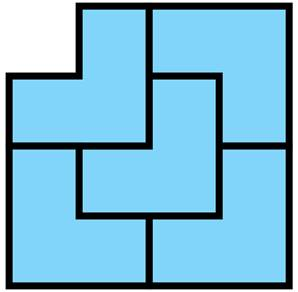
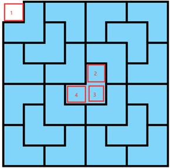

## Tromino 谜题

此项目是学校算法课大作业。

Tromino是一个由棋盘上的三个邻接方块组成的L型瓦片。我们的问题是，如何用Tromino覆盖一个缺少了一个方块（可以在棋盘上的任何位置）的2^n*2^n棋盘。除了这个缺失的方块，Tromino应该覆盖棋盘上的所有方块，而且不能有重叠。为此问题设计一个分治算法。

demo: https://tromino.now.sh

分治的思想，将复杂的问题分解到重复的简单的单个问题上，这里先按照4x4来举例，



按照顺时针分成左上、右上、右下、左下四个区域，每个区域用一个数组来记录空位的位置。

```js
Node[0] = [1, 0, 0, 0];
Node[1] = [0, 0, 0, 1];
Node[2] = [1, 0, 0, 0];
Node[3] = [0, 1, 0, 0];
```

这样就可以唯一的确定图案了，而难点就在与得到这个数组。


8x8 的样子：



还是由 0, 0（1）为初始空位，接下来就确定（2）（3）（4）这些地方是空的，这样还是将整个图形分成左上、右上、右下、左下四个区域，这样没个区域又回到了4x4的问题中了。